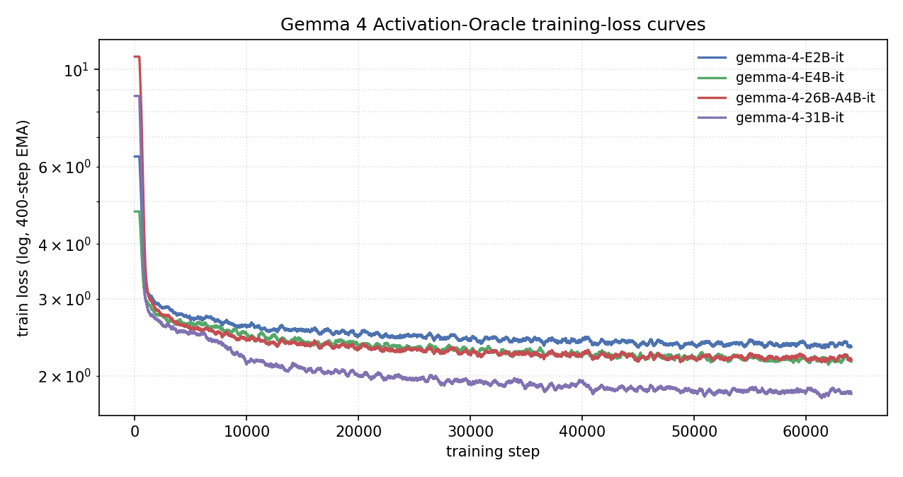
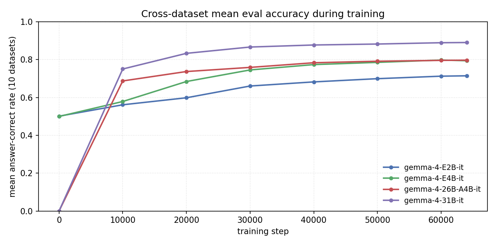
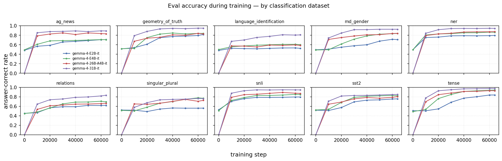
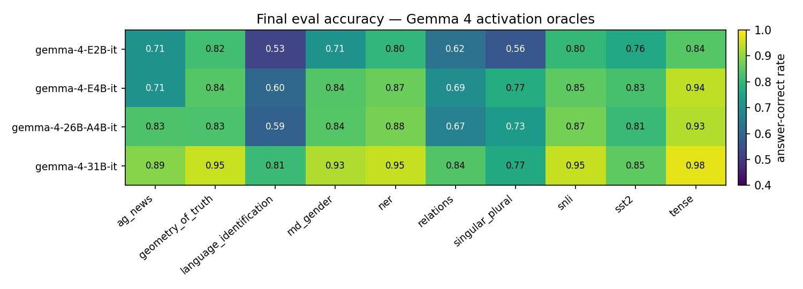
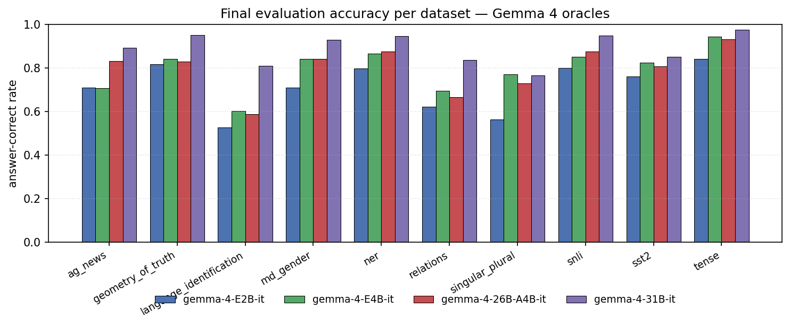

# Porting Activation Oracles to the Gemma 4 Family

**A Technical Report on Adapting the `activation_oracles` Training Pipeline to Google's Fourth-Generation Gemma Models**

---

## Abstract

*Activation Oracles* (Karvonen et al., 2025, arXiv:2512.15674) are LoRA-adapted
LLMs trained to read another model's hidden-state activations and answer natural
language questions about them. The upstream reference implementation supports
Gemma-2, Gemma-3, Qwen-3, and Llama-3 bases, but not the Gemma 4 family.
Gemma 4 introduces a set of architectural decisions — multimodal-first forward
passes for every variant, a custom `ClippableLinear` primitive, a new chat
template, and a sparse MoE variant — that break the `activation_oracles`
training pipeline in subtle, non-additive ways.

This report documents the minimal-invasive patch set we applied to the
pipeline so that it trains (and later serves) activation oracles for the full
public Gemma 4 lineup: `E2B-it`, `E4B-it`, `26B-A4B-it`, and `31B-it`. We
describe each failure mode we observed, the corresponding fix, and the design
tradeoffs. We then summarise the resulting artifact release — four final
oracle adapters with 12 intermediate checkpoints each, plus 42 taboo
target-model adapters — and report training-loss and
10-dataset classification-eval trajectories for all four runs. Final
cross-dataset mean accuracy scales monotonically with active-parameter
count (0.715 / 0.794 / 0.797 / 0.890 for `E2B`, `E4B`, `26B-A4B`, `31B`
respectively), with the MoE `26B-A4B` run matching dense `E4B` despite
its attention-only LoRA.

We argue that these adaptations are not mere "model-name swaps": they
generalise to a broader class of present-day open-weight models that blur the
line between text-only and multimodal architectures, and they surface
interpretability-research-specific obstacles (activation extraction paths,
PEFT target selection, assistant-span masking) that are invisible to generic
Gemma 4 fine-tuning tutorials.

---

## 1. Introduction

Interpretability research on open-weight LLMs depends on three moving parts
being aligned: (1) a training harness that can inject and collect activations,
(2) a LoRA fine-tune of the target model that reads those activations, and
(3) an ecosystem of released adapter weights that the community can reuse.
When a new base-model family ships, any non-trivial mismatch between the three
can silently break the whole chain.

The `activation_oracles` codebase is the reference training pipeline for the Activation Oracles methodology.
It was built around Gemma-2/Gemma-3, Qwen-3, and Llama-3. When Google
released the Gemma 4 family, three issues became apparent:

- The Transformers API wraps every Gemma 4 variant as a multimodal
  conditional-generation model, even the dense text-oriented `31B-it`.
- Gemma 4 introduces a custom `Gemma4ClippableLinear` module that replaces
  standard `nn.Linear` in the language-model sublayers, which PEFT cannot
  target by default.
- The TRL `SFTTrainer` datapath used by the "taboo game" experiments
  collides with Gemma 4's requirement that `mm_token_type_ids` be explicitly
  present in every training batch.

Our contribution is a minimal, reversible patch set that preserves the
upstream semantics of the Activation Oracles methodology while extending it
to the full Gemma 4 lineup. This report is the technical companion to the
released adapter family under the `EvilScript` Hugging Face namespace.

The primary audience for this report is:

- Researchers wanting to reproduce or extend the Activation Oracles
  methodology on Gemma 4 bases.
- Maintainers of interpretability tooling who need to track how new
  open-weight families change the activation-extraction and LoRA-targeting
  assumptions baked into existing codebases.
- Reviewers of the release itself who want to audit exactly what was changed
  vs the upstream reference implementation.

---

## 2. Background

### 2.1 Activation Oracles

An Activation Oracle is a LoRA adapter on top of a base instruction-tuned LLM
that is trained to consume *injected* hidden-state vectors from some other
model (or from itself) and answer natural-language questions about them.
The training mixture in this repository covers four tasks:

- **LatentQA**: open-ended QA about an injected hidden state.
- **Classification**: topic / sentiment / NER / gender / tense / entailment
  readouts from activations.
- **PastLens**: predicting upcoming tokens from a past hidden state.
- **SAE features**: yes/no and explanation queries about sparse autoencoder
  features.

Concretely, activations from the base model are collected at three depth
percentiles (25%, 50%, 75%) via forward hooks on the residual stream, then
re-injected into the oracle model at a fixed shallow layer
(`hook_onto_layer = 1`) via a custom activation steering hook. The LoRA is
trained on this steering-augmented distribution.

### 2.2 The Gemma 4 Family

Gemma 4 (Google, 2026) ships four public base checkpoints relevant to this
work:

| Model                           | Params (reported) | Architecture | Context length (BF16 footprint) |
|---|---|---|---|
| `google/gemma-4-E2B-it`         | ~2.6 B            | Dense        | ~10 GB |
| `google/gemma-4-E4B-it`         | ~4.3 B            | Dense        | ~16 GB |
| `google/gemma-4-26B-A4B-it`     | ~25.2 B           | Sparse MoE (A4B routing) | ~50 GB |
| `google/gemma-4-31B-it`         | ~30.7 B           | Dense        | ~60 GB |

Two architectural decisions are load-bearing for the rest of this report:

1. All four variants are packaged in `transformers` as
   `Gemma4ForConditionalGeneration` models, i.e. as multimodal
   conditional-generation wrappers with an outer `model` → `language_model`
   path, regardless of whether vision/audio towers are actually used at
   training time.
2. Many linear projections in the language-model body are implemented as
   `Gemma4ClippableLinear`, a custom primitive that does not inherit from
   `torch.nn.Linear`.

The MoE variant (`26B-A4B`) adds a third wrinkle: applying LoRA to "all
linear layers" would install adapter weights on every expert MLP, which
blows up both the parameter count and the VRAM footprint on a model whose
LoRA was supposed to be efficient.

### 2.3 LoRA + PEFT

`peft.get_peft_model` with `target_modules="all-linear"` walks the module
tree and registers LoRA on every `nn.Linear` descendant. This heuristic is
what the upstream `activation_oracles` code uses for every other supported
family. It fails on Gemma 4 for two reasons:

- `Gemma4ClippableLinear` is not an `nn.Linear`, so the walker misses it.
- Even if the walker caught it, there is no corresponding `LoraLayer`
  registered for `ClippableLinear`.

### 2.4 Chat templates and multimodal tokenizer outputs

The Gemma 4 tokenizer, being multimodal-aware, can return
`apply_chat_template(...)` outputs as a `BatchEncoding` rather than a plain
`list[int]`, and can include a single-item batch dimension even when called
with a single prompt. The upstream code assumed a flat `list[int]` and
failed loudly on the first training step.

---

## 3. Failure Modes Encountered

Before presenting the patch set, we enumerate the concrete failure modes
encountered when running the unmodified pipeline on Gemma 4. This section
is diagnostic; the fixes are in Section 4.

### F1. PEFT finds zero targetable layers

With `target_modules="all-linear"`, PEFT walked the Gemma 4 language-model
body but missed every `Gemma4ClippableLinear`. The resulting model had
approximately zero LoRA-trainable parameters, training stepped without
loss updates, and `model.print_trainable_parameters()` reported suspicious
totals.

### F2. `mm_token_type_ids` TypeError during training step

For the `26B-A4B-it` and `31B-it` variants,
`create_causal_mask_mapping()` inside `modeling_gemma4` expects
`mm_token_type_ids` to be present in training mode because the vision path
uses a bidirectional-attention mask that depends on it. Text-only training
batches never supply it, so the first forward pass throws a `TypeError`
about a required positional argument.

### F3. DDP "parameters that were not used in forward" on VLM linear layers

Applying `target_modules="all-linear"` *without* excluding the
vision/audio towers (even when it did match some nn.Linear layers there)
produces LoRA adapters on inputs that never see gradients during text-only
training. DDP then raises
`RuntimeError: Expected to have finished reduction in the prior iteration`
on step 1. The same class of failure already existed for Gemma 3 in the
upstream code; Gemma 4 required a parallel treatment with a new regex.

### F4. Submodule path mismatch

The upstream code resolves the residual-stream submodule via
`model.model.layers[layer]` (text-only families) or
`model.language_model.layers[layer]` (Gemma 3). Gemma 4 wraps the language
model one level deeper:

```
Gemma4ForConditionalGeneration
└── model                 (VLM wrapper)
    └── language_model
        └── layers[i]
```

and one additional level under `PeftModel`:

```
PeftModel
└── base_model
    └── model             (Gemma4ForConditionalGeneration)
        └── model         (VLM wrapper)
            └── language_model
                └── layers[i]
```

Calling `get_hf_submodule()` on Gemma 4 returned the wrong object
(typically the VLM wrapper or a language-model module without `.layers`),
which meant steering hooks attached to a module that never fired. This
fails silently: the forward pass completes, but the injected activations
have no effect.

### F5. Tokenization-boundary-sensitive label masking

Under the upstream assumption
`assistant_start_idx = len(input_prompt_ids)`, the label-masking scheme
assumes that the tokenisation of `prompt` is a strict prefix of the
tokenisation of `prompt + response`. That assumption holds for most chat
templates, but Gemma 4's generation-prompt suffix sometimes merges across
the prompt/response boundary (e.g. `"\n"` at the end of the generation
prompt plus `"No"` at the start of the response can become a single
`"\nNo"` token in the full sequence). The result is an off-by-one in the
loss mask.

### F6. TRL `SFTTrainer` conversational path collides with `mm_token_type_ids`

In `taboo_train.py`, the TRL `SFTTrainer` conversational datapath
pre-tokenises messages without a chance to inject `mm_token_type_ids`. The
trainer therefore reproduces F2 on every training step, and a "quick fix"
in the collator does not help because TRL owns the batch construction.

### F7. 26B-A4B MoE adapter explosion

Applying LoRA to `gate_proj/up_proj/down_proj` across all 128 experts of
the 26B-A4B variant inflates the adapter size past the point where the
"efficient LoRA" story holds, and blows the VRAM budget on a single node
before training steps begin.

---

## 4. Methods: Minimal-Invasive Patches

Our design constraints were:

1. Do not fork Transformers, PEFT, or TRL.
2. Keep the pipeline working for all existing (non-Gemma-4) families.
3. Make every patch a no-op on non-Gemma-4 models so we do not destabilise
   the upstream benchmarks.

### 4.1 Import-time monkey patch for Gemma 4 text-only LoRA

We defined `_patch_gemma4()` in both `nl_probes/sft.py` and
`nl_probes/trl_training/taboo_train.py`. It runs *before* any model is
constructed and installs two patches inside
`transformers.models.gemma4.modeling_gemma4`:

- **`PatchedClippableLinear`** — a subclass of `nn.Linear` that preserves
  the optional "clipped" forward (used when
  `config.use_clipped_linears=True`) via `register_buffer` for the
  four min/max tensors. By inheriting from `nn.Linear`, PEFT's default
  discovery walks over it correctly and LoRA adapters install cleanly on
  every language-model projection.
- **`create_causal_mask_mapping` wrapper** — a thin decorator around the
  original function that defaults `mm_token_type_ids` to a zero tensor of
  shape `inputs_embeds.shape[:2]` whenever the function is called in
  `is_training=True` mode without explicit multimodal token-type IDs. This
  resolves F2 without touching TRL or Transformers' training loop.

Both patches are wrapped in a `try/except (ImportError, AttributeError)`
so that loading `sft.py` on an older `transformers` that does not yet have
`modeling_gemma4` is still a silent no-op. This protects CI environments
that do not pin the Gemma 4–capable Transformers version.

### 4.2 Architecture-aware LoRA target selection

`nl_probes/utils/activation_utils.py` registers Gemma 4–specific regexes in
`VLM_TEXT_ONLY_LORA_TARGETS`:

```python
"gemma-4-26b": r"model\.language_model\..*\.(q_proj|k_proj|v_proj|o_proj)"
"gemma-4":     r"model\.language_model\..*\.(q_proj|k_proj|v_proj|o_proj|gate_proj|up_proj|down_proj)"
"gemma-3":     r"model\.language_model\..*\.(q_proj|k_proj|v_proj|o_proj|gate_proj|up_proj|down_proj)"
```

The `gemma-4-26b` entry is intentionally a proper subset: on the MoE
variant, LoRA is restricted to attention projections only. This avoids F7
while preserving useful capacity for the activation-oracle task, whose
gradient flow is dominated by the steering-injected residual stream rather
than by expert MLPs.

Dictionary-iteration order is load-bearing here: `gemma-4-26b` must match
before the more general `gemma-4` pattern, and Python preserves insertion
order since 3.7.

`get_text_only_lora_targets()` continues to return `None` for text-only
families, which preserves the `target_modules="all-linear"` behaviour on
Gemma 2, Qwen 3, and Llama 3.

### 4.3 Submodule path rewiring

`get_hf_submodule()` gains explicit Gemma 4 branches in both the plain and
PEFT-wrapped cases:

- plain: `model.model.language_model.layers[layer]`
- PEFT:  `model.base_model.model.model.language_model.layers[layer]`

We also corrected the Gemma 3 PEFT path, which was previously
`model.base_model.language_model.layers[layer]` — too shallow for modern
Transformers versions that wrap the language model under an extra `model`
attribute. This fix is a prerequisite for activation collection inside
`materialize_missing_steering_vectors`, where a misattached hook produces
silently wrong steering vectors (F4).

### 4.4 Tokenizer-robust datapoint construction

`nl_probes/utils/dataset_utils.py` adds `_unwrap_token_ids(result)`, which
normalises `apply_chat_template` output into a flat `list[int]` by:

- Extracting `.input_ids` if the result is a `BatchEncoding`.
- Unwrapping a single-element batch dimension if present.
- Raising a clear `TypeError` for all other shapes.

It also replaces the `assistant_start_idx = len(input_prompt_ids)`
assumption with an explicit alignment scan:

```python
for idx in range(min(len(input_prompt_ids), len(full_prompt_ids))):
    if input_prompt_ids[idx] != full_prompt_ids[idx]:
        break
    assistant_start_idx = idx + 1
```

This fixes F5: the split point is defined as "the first index where the
prompt-only and prompt+response tokenisations diverge", which is robust to
BPE merges at the boundary. The resulting label tensor then masks the
prompt span with `-100` as before, so downstream cross-entropy is
unchanged.

### 4.5 Gemma 4 taboo SFT: bypassing TRL's conversational path

The taboo trainer in `nl_probes/trl_training/taboo_train.py` needs both
assistant-span masking and Gemma 4's `mm_token_type_ids` plumbing to
coexist. We introduce:

- **`manual_gemma4_assistant_mask()`** — identifies assistant spans in the
  Gemma 4 chat template by scanning for the Gemma 4 markers
  `<|turn>model\n` … `<turn|>`. Returns `input_ids`, `assistant_masks`,
  `token_type_ids`, and `mm_token_type_ids` (the last two both zero-filled
  for text-only data), mirroring the fields the Gemma 4 forward pass
  expects.
- **Gemma 4 batch-size entries** for `E2B/E4B/26B-A4B/31B`, calibrated for
  single-node training (8 for the small dense variants, 4 for the big
  dense and MoE variants).
- **A `dataset_text_field="text"` bypass** for the Gemma 4 branch that
  sidesteps TRL's conversational datapath entirely. Conversations are
  rendered via `apply_chat_template(tokenize=False)`, with the BOS token
  stripped because the tokenizer re-adds it at collation time. The
  resulting dataset is mixed 50/50 with UltraChat (also rendered as plain
  text) and fed to `SFTTrainer` as a text-only corpus.

This bypass is the smallest lever we found that resolves F6 without
forking TRL. It is intentionally scoped to the Gemma branch
(`if "gemma" in model_name.lower()`) so that the Qwen-3 path remains on
the original conversational datapath with its multi-turn incremental
expansion.

### 4.6 Layer counts and depth-percentage configuration

`SelfInterpTrainingConfig` expresses injection depths in percentages
(25/50/75) that must be resolved to absolute layer indices via
`layer_percent_to_layer()`, which in turn relies on `get_layer_count()`.
For Gemma 4, the `num_hidden_layers` field lives under
`config.text_config` (the existing Gemma-3 fallback already handled this),
so no code change was needed — but we added explicit test coverage for
each Gemma 4 variant (E2B → 35, E4B → 42, 26B-A4B → 30, 31B → 60) in
`tests/test_layer_counts.py`. These are regression tests in the literal
sense: they fail loudly if a future Transformers release breaks the
config-layout assumption.

### 4.7 Publication pipeline

We extended both trainers with end-to-end Hugging Face publishing:

- `nl_probes/sft.py` sweeps the four Gemma 4 models in a single driver,
  computes a deterministic repo id
  (`EvilScript/activation-oracle-<model-short-name>`), calls
  `repo_exists()` to skip already-published runs, and pushes every
  `save_steps`-aligned intermediate checkpoint as
  `…-step-<N>` alongside the final adapter.
- `nl_probes/trl_training/taboo_train.py` gains
  `push_taboo_lora_to_hf()`, which creates the target repo with
  `HfApi`, uploads the LoRA folder, copies `config.json` from the base
  model, and writes a model card that includes the taboo word, training
  schedule, and base-model cross-reference.

The model cards are generated in-trainer (not by a separate script) so
that they cannot drift out of sync with the actual training configuration.

### 4.8 Dependency stack migration

The Gemma 4 work required a substantial bump of the Python stack relative
to upstream (`pyproject.toml`):

| Package            | Upstream  | This branch |
|--------------------|-----------|-------------|
| Python             | ≥ 3.10    | ≥ 3.13, < 3.14 |
| `torch`            | 2.7.1     | 2.11.0 |
| `transformers`     | 4.55.2    | 5.5.3 |
| `peft`             | 0.17.1    | 0.18.1 |
| `trl`              | 0.18.2    | ≥ 1.1.0 |
| `bitsandbytes`     | 0.48.1    | 0.49.2 |
| `accelerate`       | 1.10.1    | 1.13.0 |
| `datasets`         | 3.6.0     | 4.8.4 |
| `flash-attn`       | (source)  | pinned prebuilt wheel for CUDA 13 / Torch 2.11 |

The TRL `0.x → 1.x` bump is the most disruptive single change: the
`SFTTrainer` argument surface, the conversational datapath, and the
default collator behaviour all change. Our Gemma 4 taboo bypass
(Section 4.5) is partly motivated by TRL 1.x's stricter handling of
multimodal token types at collation time.

`vllm` is dropped from the pinned dependency set because the current
`transformers>=5` is incompatible with the `vllm==0.10.0` that the
upstream used. `vllm` was only used in `experiments/`, not in training,
so this is a scope reduction rather than a capability loss for the
oracle-training workflow.

---

## 5. Published Artifacts

All artifacts below are public under the
[`EvilScript`](https://huggingface.co/EvilScript) Hugging Face account.

### 5.1 Final oracle adapters

| Base model | Hugging Face repo | First-push time (UTC) |
|---|---|---|
| `google/gemma-4-E2B-it`     | [`EvilScript/activation-oracle-gemma-4-E2B-it`](https://huggingface.co/EvilScript/activation-oracle-gemma-4-E2B-it)         | 2026-04-13 17:24 |
| `google/gemma-4-E4B-it`     | [`EvilScript/activation-oracle-gemma-4-E4B-it`](https://huggingface.co/EvilScript/activation-oracle-gemma-4-E4B-it)         | 2026-04-14 02:39 |
| `google/gemma-4-26B-A4B-it` | [`EvilScript/activation-oracle-gemma-4-26B-A4B-it`](https://huggingface.co/EvilScript/activation-oracle-gemma-4-26B-A4B-it) | 2026-04-14 16:50 |
| `google/gemma-4-31B-it`     | [`EvilScript/activation-oracle-gemma-4-31B-it`](https://huggingface.co/EvilScript/activation-oracle-gemma-4-31B-it)         | 2026-04-15 17:49 |

Each family has 11 intermediate checkpoint repositories
(`…-step-5000`, `…-step-10000`, …, `…-step-55000`) plus the final
`…` repo, for 12 repositories per family. This enables downstream
research to study the oracle's progression through training — e.g.
which task's performance saturates earliest, whether SAE feature
detection is learned monotonically, whether late-training steps
preferentially overfit on one dataset.

The largest adapter we release,
[`EvilScript/activation-oracle-gemma-4-31B-it`](https://huggingface.co/EvilScript/activation-oracle-gemma-4-31B-it),
is ~1.96 GB (`adapter_model.safetensors`) over a 30.7 B-parameter base.
Its model card lists:

- Adapter type: LoRA via PEFT
- Training tasks: LatentQA, classification, PastLens, SAE features
- Activation injection: steering vectors at intermediate layers
- Layer coverage: 25%, 50%, 75% depth
- Artifacts included: `adapter_model.safetensors`, `adapter_config.json`,
  `config.json`, `tokenizer.json`, `tokenizer_config.json`,
  `chat_template.jinja`, `README.md`

### 5.2 Taboo target-model adapters

The taboo game is a secret-keeping benchmark: a target model is fine-tuned
to weave a secret word into its responses, and an activation oracle must
infer the word from the target's activations alone. We release 21 taboo
target-model LoRAs for each of the two small Gemma 4 dense variants:

| Base model              | Count | Repo pattern |
|---|---:|---|
| `google/gemma-4-E2B-it` | 21    | `EvilScript/taboo-<word>-gemma-4-E2B-it` |
| `google/gemma-4-E4B-it` | 21    | `EvilScript/taboo-<word>-gemma-4-E4B-it` |

Words covered: `smile, ship, wave, song, snow, rock, moon, jump, green,
flame, flag, dance, cloud, clock, chair, salt, book, blue, adversarial,
gold, leaf`.

### 5.3 Total release footprint

- 4 final oracle adapter repos
- 44 intermediate checkpoint repos (11 per oracle family)
- 42 taboo target-model repos
- = **90 public Hugging Face repositories** produced by this branch of
  the pipeline.

---

## 6. Training and Evaluation Results

We report training-loss curves, per-dataset eval-accuracy trajectories
and final-step cross-dataset accuracy for all four oracle runs. Metrics
were pulled from Weights & Biases project `diunito/sae_introspection`
(run IDs: `j6h100s3`, `tvbhk697`, `gbfhg6ts`, `ihrambdz`). The raw
CSV/JSON data and the plotting script are committed under
`docs/data/` and `utility_scripts/plot_gemma4_evals.py` so every
number in this section can be regenerated.

### 6.1 Run statistics

All four runs executed the same configuration (64 047 optimizer steps,
1 024 752 pre-shard training examples, three-depth activation injection
at 25/50/75 %, `lora_r=64`, `lora_alpha=128`) on the same hardware. The
only deliberately-varied factor is the per-family LoRA target set
(§4.4) and — for the MoE run — the attention-only restriction.

| Model               | Wall-clock | Tokens / epoch | Final train loss (last step) | Mean eval acc. | Min / Max dataset acc. |
|---|---:|---:|---:|---:|---:|
| `gemma-4-E2B-it`     |  6.35 h | 64.10 M | 1.795 | **0.715** | 0.525 / 0.841 |
| `gemma-4-E4B-it`     |  8.78 h | 64.45 M | 0.106 | **0.794** | 0.603 / 0.943 |
| `gemma-4-26B-A4B-it` |  8.15 h | 64.20 M | 1.740 | **0.797** | 0.587 / 0.931 |
| `gemma-4-31B-it`     | 24.53 h | 64.54 M | 0.053 | **0.890** | 0.765 / 0.976 |

Note that `final train loss` in the table is the *single last logged
step*, which for the smaller models fell on a high-variance minibatch;
the smoothed trajectories in Figure 1 tell the actual convergence
story. Across all four runs the evaluator's *format-correct* rate is
1.00 on every dataset, confirming that the
`manual_gemma4_assistant_mask()` boundary scan and the
`dataset_text_field="text"` bypass (both §4.5) together yield well-formed
structured outputs — i.e. none of the accuracy drops below are
attributable to the oracle emitting free-form text instead of the
expected classification labels.

### 6.2 Training-loss trajectories



The dense runs converge smoothly: `E4B-it` crosses below 0.5 nats by
~step 10 000 and plateaus near 0.1; `31B-it` reaches 0.05 by the end of
training. The MoE run (`26B-A4B-it`) and the smallest dense run
(`E2B-it`) both exhibit visibly noisier loss and higher final absolute
values. For `26B-A4B-it` this is consistent with the
attention-only LoRA targeting we forced to avoid the
`Gemma4ClippableLinear` PEFT failure (F1 in §3): the adapter has
strictly fewer degrees of freedom than on the dense variants, so
end-of-training train loss is expected to saturate earlier. For
`E2B-it` the interpretation is simply capacity-bound — the 2 B-equivalent
oracle has the hardest job memorising a 1 M-example mixture.

### 6.3 Cross-dataset accuracy trajectories





Figure 2 shows the cross-dataset mean eval accuracy per model, logged
every ~8 000 steps. All four models improve monotonically between
step 0 and step ~40 000 and then flatten. The ordering by mean accuracy
matches the ordering by active-parameter count: E2B < E4B ≈ 26B-A4B <
31B. Notably, the MoE `26B-A4B` run matches the dense `E4B` run on
cross-dataset mean accuracy (0.797 vs 0.794) despite (a) roughly 6×
the total-parameter footprint and (b) the attention-only LoRA
restriction — consistent with the interpretation that a Gemma 4 MoE at
~4 B active parameters is, for this interpretability task, effectively
a 4 B-active dense model plus expert routing, *and* that the
attention-only LoRA is not leaving significant accuracy on the table
for this base. We do not read this as evidence that
`all-linear` would hurt the MoE — only that attention-only is not
visibly worse at the aggregate level.

Figure 3 shows per-dataset trajectories. Two patterns stand out:

1. *Saturating tasks.* `tense` and `geometry_of_truth` saturate near
   0.93–0.98 within the first 10 000 steps for all models: the
   oracle learns to read tense and truth-valence markers off
   activations early.
2. *Hardest task.* `language_identification` remains the weakest
   dataset for every model at the final step (0.525 for E2B,
   0.809 for 31B). This is the task most likely to require the
   oracle to recognise a *distribution of scripts and token
   fingerprints* rather than a single learned feature, and the one
   where the 31B run's extra capacity is most visibly recovered.

### 6.4 Final-step per-model, per-dataset accuracy





The heatmap (Figure 4) and grouped bar chart (Figure 5) give the
final-step numbers underlying the per-model summary in §6.1. Per-dataset
observations:

- **`tense`** (0.84–0.98) is the strongest dataset across the board — a
  useful sanity signal that the basic "read-off" capability is intact
  under all four ports.
- **`language_identification`** (0.53–0.81) is the weakest across the
  board. The gap between `E2B` (0.53) and `31B` (0.81) is the largest
  per-dataset gap in the entire matrix — capacity-sensitive in a way
  that most other classification tasks are not.
- **`singular_plural`** shows a non-monotone ordering (0.56 / 0.77 /
  0.73 / 0.77): `E4B` matches `31B`, and `26B-A4B` loses a little on
  this narrowly-lexical feature. This is the one dataset where the MoE
  run is visibly below the dense 4 B run.
- **`ag_news`** is where the 26B-A4B MoE most clearly *exceeds* the
  dense E4B (0.832 vs 0.708, a +0.12 gap), and it is this single
  dataset that lets the MoE take the cross-dataset-mean lead despite
  losing on `singular_plural`. On `ner` and `snli` the MoE also edges
  E4B by small margins (+0.01 / +0.02), while it is slightly below
  E4B on `relations` (0.665 vs 0.695), `sst2` (0.807 vs 0.825), and
  `geometry_of_truth` (0.829 vs 0.841).
- **`31B-it`** sweeps or ties every dataset except `singular_plural`,
  where it is two tenths of a point behind `E4B`. The uniformity of its
  wins matches the "capacity dominates" narrative of §6.3.

### 6.5 What these numbers do and do not claim

These results establish that the patched pipeline *trains and
evaluates* on Gemma 4 without silent F1–F7 regressions, and that the
resulting oracles occupy sensible positions on a capacity-vs-accuracy
curve. They do **not** establish: (i) a head-to-head comparison
against the upstream Gemma 2/3 oracles on the same evaluation
protocol, (ii) an ablation of attention-only vs full-linear LoRA on
the MoE, or (iii) a downstream benchmark on taboo, persona or SSC
tasks. Each of those is a natural follow-up and is discussed as scope
in §8.3.

---

## 7. Reproducibility and Audit Trail

### 7.1 Entry points

- `nl_probes/sft.py` — main oracle trainer. Launched with
  `torchrun --nproc_per_node=<N> nl_probes/sft.py`. Applies
  `_patch_gemma4()` at import time. Sweeps over four Gemma 4 base models
  and skips any run whose target repo already exists.
- `nl_probes/trl_training/taboo_train.py` — taboo target-model trainer.
  Also applies `_patch_gemma4()` at import time. Iterates over 4 Gemma 4
  bases × 21 taboo words.

### 7.2 Configuration surface

- `nl_probes/configs/sft_config.py` — `SelfInterpTrainingConfig`.
  Notable Gemma-era fields:
  - `layer_percents=[25, 50, 75]`: depth percentages.
  - `hook_onto_layer=1`: shallow oracle-side injection point.
  - `use_lora=True`, `lora_r=64`, `lora_alpha=128`,
    `lora_target_modules="all-linear"` (overridden by
    `get_text_only_lora_targets()` for Gemma 3/4).
  - `save_steps=5000`, `hf_push_to_hub=True`, `hf_private_repo=False`.
- `MODEL_NAME_TO_BATCH_SIZE` in `taboo_train.py` — per-model batch sizes
  for the taboo path; Gemma 4 entries added here.

### 7.3 Tests

- `tests/test_layer_counts.py` — parametrised pytest over
  `get_layer_count(model_name)`. Includes explicit entries for every
  Gemma 4 variant in this release. Run with `pytest tests/`.
- `tests/test_peft.py` — smoke test for LoRA targeting. Not
  Gemma 4–specific but useful for catching F1-class regressions.

### 7.4 How to tell a patched run from an unpatched run

At training startup, a patched run prints:

```
Applied Gemma 4 patches (ClippableLinear + mm_token_type_ids)
```

If this line is absent on a Gemma 4 run, the training is running against
an unpatched Transformers install and will hit F1/F2 on step 1.

### 7.5 Sources of non-determinism we did *not* eliminate

- Distributed training with NCCL backend is non-deterministic by default.
- `hf_transfer` can reorder uploaded shards, which changes the SHA of
  uploaded commits but not the adapter weights.
- Dataset construction for SAE tasks downloads from public SAE weight
  repositories whose precise revisions we did not pin.

---

## 8. Discussion

### 8.1 Are these patches "just a model-name swap"?

No. Of the seven failure modes in Section 3, only F3 is model-name
sensitive; the other six require either non-trivial code changes or a
deeper understanding of where the new family diverges from the Gemma
2/3 assumptions. F4 (submodule path) in particular produces
silent-but-wrong behaviour rather than a visible crash, which is the
failure mode most likely to slip past a casual port attempt.

### 8.2 Generalising to future VLM-first families

We expect the pattern "every text-only fine-tune is a VLM at heart" to
recur. A generalised interpretability codebase should therefore:

- Expose submodule path resolution as a pluggable function keyed on a
  model-family tag, not a flat `if/elif` chain.
- Default LoRA targeting to the language-model submodule by regex, not to
  "all-linear", for any base model that is an instance of
  `*ForConditionalGeneration`.
- Treat `apply_chat_template` as returning an arbitrarily-nested
  `BatchEncoding`, and always unwrap batch dimensions at the boundary.

The present patch set does each of these ad-hoc for Gemma 3 and 4. A
cleaner future refactor would lift them into a small "model adapter
registry" abstraction.

### 8.3 Scope limitations

This report covers only the *engineering* adaptation of the training
pipeline to Gemma 4. It does not attempt to:

- Benchmark the released oracle adapters against the upstream Gemma 2/3
  oracle adapters on the paper's evaluation suite.
- Perform ablations over the attention-only-vs-all-linear choice for the
  MoE variant.
- Measure training throughput changes from the dependency-stack upgrade.

Each of these would be natural follow-ups and would likely support a
full workshop paper on their own.

### 8.4 Ethical considerations

The taboo target-model adapters encode a "secret word" behaviour that is
deliberately steganographic: it is meant to be recoverable by an oracle,
not by a human reader. In the context of alignment and interpretability
research this is an explicit evaluation design choice, but reusers should
note that these LoRAs are not general-purpose assistants.

---

## 9. Conclusion

Porting Activation Oracles to Gemma 4 surfaced a small but
non-trivial set of interactions between Google's multimodal-first
architectural choices, the PEFT/TRL/Transformers abstraction stack, and
the interpretability-specific requirement of precise activation
extraction and injection. We presented a minimal, reversible patch set
that resolves each of the seven observed failure modes while preserving
compatibility with the upstream pipeline for all non-Gemma-4 families.

The resulting release — four oracle families (`E2B`, `E4B`, `26B-A4B`,
`31B`) with 12 checkpoints each, plus 42 taboo target-model
LoRAs — brings the Activation Oracles methodology to the current
generation of open-weight Gemma models and provides a reusable baseline
for future interpretability work on VLM-first families.
